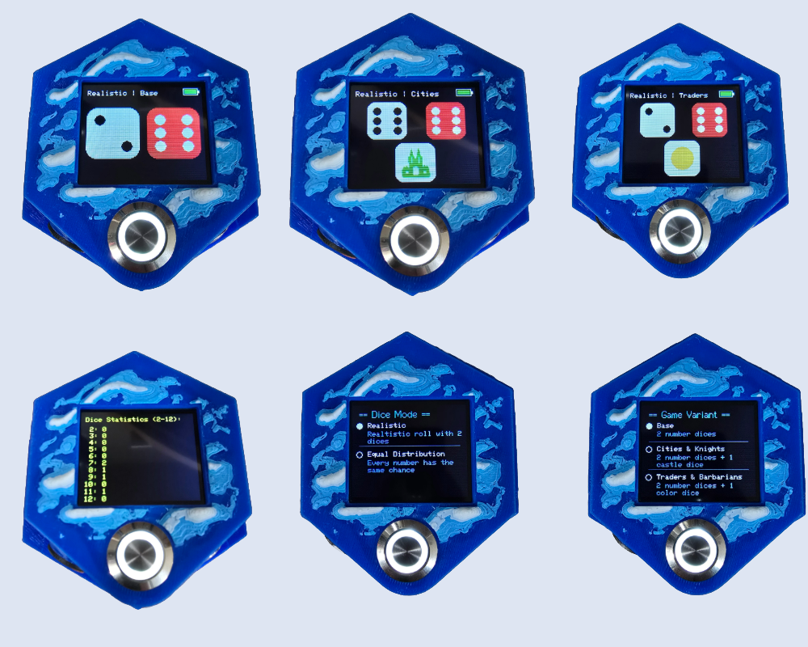

# 🎲 Catan Digital Dice – ESP32-C3 Powered

A smart digital dice module made specifically for **The Settlers of Catan**. Featuring a vibrant TFT screen, intuitive button controls, and multiple dice modes including full expansion support. The device integrates magnetically into the board by replacing a desert or water hex in the **Danzkala 2.0 terrain system**.

---

## ✨ Features

- 🎲 **Two Dice Modes**:
  - *Realistic Probability*: Follows true dice distribution (7 most common, 2 and 12 rare).
  - *Equal Probability*: Each number (2–12) has an equal chance of appearing. Adds a fun and unexpected twist to your games!

- 🏰 **Expansion Support**:
  - *Cities & Knights*: Adds a custom pirate/fortress die.
  - *Traders & Barbarians*: Includes a colored event die.

- 📈 **Live Dice Statistics**:
  - Hold the roll button to show stats of all numbers rolled so far.
  - End the “my number never comes up” arguments — now with proof!

- 🔋 **Energy Saving Mode**:
  - Optional auto-sleep after 5 or 10 minutes (or disable sleep entirely).
  - In deep sleep: ~0.5mA power draw.
  - Example: A 1000 mAh battery can last ~80 days in standby.

- ⚡ **USB Charging via TP4056 module**

- 📊 **Battery Level Indicator on-screen**

- 💾 **All settings are saved** even after power-off

- 🔁 **Dice stats reset** on power-up or returning to menu

---

## ⚡ Easy Web Installer – No Arduino IDE Needed

💡 You can flash the firmware directly from your browser using the **ESP Web Tools**!  
No setup, no headaches.

👉 [Click here to flash the firmware in your browser](https://example.com/flash-url) *(placeholder)*

---

## 🧩 Assembly Guide

### Step-by-Step Images

 

### 🧰 Assembly Steps Overview

1. **Dry-fit all components** in the housing to check spacing and placement. This helps visualize the layout and confirms the correct installation order.
2. **Prepare the ESP32-C3 Super Mini** by soldering **female pin headers** to one side only (the display-facing side). Leave the other side unsoldered for now — you'll connect the switches and power later.
3. **Prepare the TP4056 module**:
   - Solder equally long wires to all pins (they’ll be trimmed to size later).
   - Solder two **equal-value resistors** (e.g., 51 kΩ) to form a **voltage divider** for battery monitoring. Connect the midpoint with a wire — this will later go to the ESP32's ADC input.
4. *(Optional)*: If using a front cover or decorative frame for the display, glue it on now.
5. Place the **TP4056 module** into its position in the case.
6. Install the **16 mm main push button** and solder all wires with equal lengths. I recommend connecting one **switch pin and the LED's GND pin** together early on.
7. Mount the **1.77" TFT display** and install the **12 mm menu button**, again using equal-length wires.
   - Also connect the **OUT- pin** from the TP4056 to the **GND of the main button** — I use this GND as a central **ground distribution point**.
   - Connect the **menu button’s GND** to this shared ground as well.
8. Install the **15 mm on/off switch**.
   - Connect **OUT+ from the TP4056** to one side of the switch.
   - The other wire from the switch will later go to the **5 V input on the ESP32**.
   - Use a bit of **hot glue** to secure the display and loose wires if needed.
9. Insert the **16340 Li-Ion battery** into the housing and secure it with hot glue.
   - Connect **battery – (negative)** to **B-** on the TP4056.
   - Connect **battery + (positive)** to **B+** on the TP4056.
10. **Wire the ESP32-C3** according to the following pin layout:
    - Main button switch → `GPIO0`
    - Main button + (LED) → `GPIO1`
    - Menu button switch → `GPIO2`
    - Menu button + (LED) → `GPIO3`
    - Voltage divider wire (middle point between resistors) → `GPIO4`
    - On/off switch output → `5V`
    - Shared GND from the 16 mm button (ground hub) → `GND`
11. Plug the **ESP32 module onto the display’s pin header**.
12. Flip the switch, power on — and **test your build**. You're done!

---
### 🔌 Wiring Table – ESP32-C3 Connections

| Component                      | Connection To             | Notes                                                                 |
|-------------------------------|---------------------------|-----------------------------------------------------------------------|
| Main Button (switch)          | `GPIO0`                   | Triggers dice roll                                                    |
| Main Button (LED +)           | `GPIO1`                   | Powers LED inside the button                                          |
| Menu Button (switch)          | `GPIO2`                   | Opens settings/menu                                                   |
| Menu Button (LED +)           | `GPIO3`                   | Powers LED inside the button                                          |
| Voltage Divider (middle point)| `GPIO4`                   | Reads battery voltage via ADC                                         |
| Common Ground (buttons, display, TP4056) | `GND`         | Shared GND for all components                                         |
| Power from TP4056 (via switch)| `5V`                      | Power input from battery (switched)                                   |
| Display (SPI)                 | Header connection         | Connected via matching female pin headers                             |

---
### 🔋 TP4056 Wiring

| TP4056 Pin | Connection To                  | Notes                                                                 |
|------------|--------------------------------|-----------------------------------------------------------------------|
| `B+`       | Battery positive (`+`)         | Connect to + terminal of Li-Ion cell                                  |
| `B-`       | Battery negative (`–`)         | Connect to – terminal of Li-Ion cell                                  |
| `OUT+`     | To power switch → ESP32 `5V`   | Feeds 5V into the ESP32 (via physical switch)                         |
| `OUT–`     | GND (to buttons/distribution)  | Used as GND source and common ground distribution point               |

---
## ⚙️ Technical Choices

- **Microcontroller**: ESP32-C3 Super Mini – with ME6211 low dropout LDO, great for 3.7V Li-Ion batteries. The pin header layout of the ESP32-C3 Super Mini matches perfectly with the 1.77" TFT display, simplifying wiring and saving space.
- **Display**: 1.77” 128×160 TFT – largest screen that fits into a Catan hex.
- **Charger**: TP4056 with USB-C or Micro-USB + protection circuit.
- **Buttons**:
  - 16 mm illuminated push button for rolling
  - 12 mm illuminated button for menu access
- **Power switch**: Fully disconnects ESP32
- **Power consumption**:
  - Active: ~50–55 mA
  - Deep Sleep: ~0.5 mA

---

## 🔋 Battery Options & Runtime

  - A **16340 Li-Ion cell** fits perfectly into the case. These are inexpensive on AliExpress — but be careful: I tested one labeled *2800 mAh* and it only delivered **150 mAh** under load.
  - I now use this more reliable version from pulsebox - found on [Amazon](https://amzn.to/3XQ1e4Q), which is a bit more expensive but delivered **around 560 mAh** of its claimed 950 mAh — good for roughly **10 hours of continuous dice usage**.
  - If you want **higher capacity**, these also fit (snugly):
    - [803040 (1000 mAh)](https://s.click.aliexpress.com/e/_ool9yJB)
    - [103040 (1200 mAh)](https://s.click.aliexpress.com/e/_ool9yJB)
  - Alternatively, you can **omit the battery** and simply connect a **USB cable** to a power bank or charger — totally optional and up to personal preference.

| Battery | Claimed Capacity | Measured | Estimated Runtime |
|--------|------------------|----------|--------------------|
| 16340 (AliExpress) | 2800mAh | 150mAh | ~3 hrs |
| 16340 (Amazon) | 950mAh | 560mAh | ~10 hrs |
| 103040 | 1200mAh | ?? | ~18–20 hrs |
| Deep Sleep | 1000mAh | — | ~80 days standby |

---

## 🧰 Parts List

| Part | Link |
|------|------|
| ESP32-C3 Super Mini | [AliExpress](https://s.click.aliexpress.com/e/_oowbwZ3) |
| 2× 8-pin Female Header | [AliExpress](https://s.click.aliexpress.com/e/_oowbwZ3) |
| TP4056 Charger Module | [AliExpress](https://s.click.aliexpress.com/e/_opG1rXL) |
| 16 mm Push Button (with LED) | [AliExpress](https://s.click.aliexpress.com/e/_olcFQ3r) |
| 12 mm Push Button (with LED) | [AliExpress](https://s.click.aliexpress.com/e/_olcFQ3r) |
| 15 mm On/Off Toggle Switch | [AliExpress](https://s.click.aliexpress.com/e/_oEo6wmd) |
| 1.77” TFT Color Display (128×160 px) | [AliExpress](https://s.click.aliexpress.com/e/_om0W0qz) |
| 2× 51kΩ Resistors (battery voltage divider) | [AliExpress](https://s.click.aliexpress.com/e/_oDQd9df) |
| 2× M3×6 Screws | — |
| Flexible AWG28 Wires | [AliExpress](https://s.click.aliexpress.com/e/_ok4vZu5) |

> For the voltage divider: both resistors must have equal value. If using different values, the code must be adjusted.

---

## 🧱 3D Print Files

All STL files can be found on **MakerWorld**.  
They are designed to perfectly snap into your Catan terrain using embedded magnets.

🧩 [View STL files on MakerWorld](https://example.com/makerworld-link) *(placeholder)*

---

## 💻 Firmware

- Compatible with **ESP32-C3 Super Mini**
- Built with:
  - `TFT_eSPI` (display)
  - `EEPROM` (config saving)
  - `esp_deep_sleep` (power saving)
- Upload via:
  - **ESP Web Tools (browser flashing)**
  - Or traditional methods (Arduino IDE / PlatformIO)

---

## 🙌 Credits

Made with ❤️ by **Timo Altholtmann**  

---

